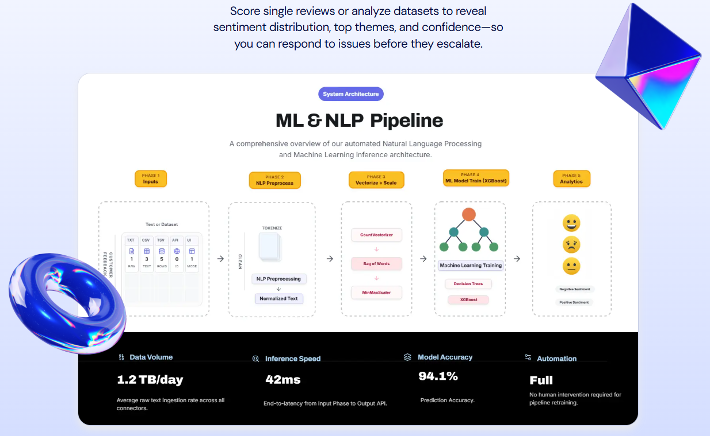
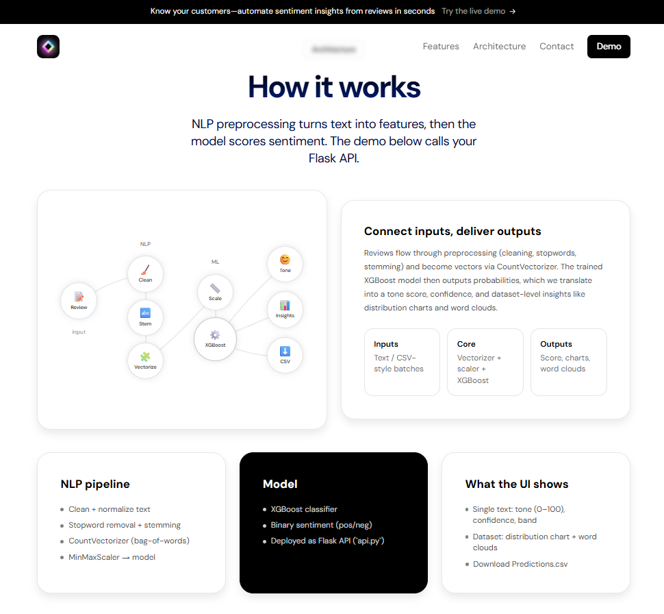
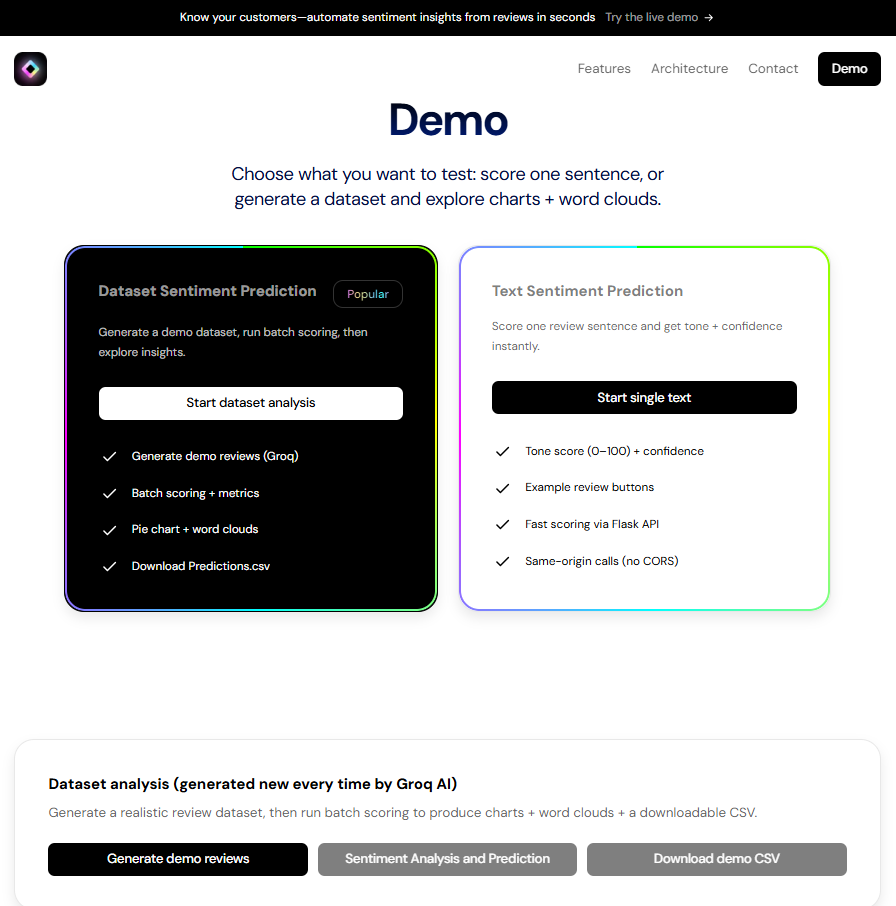

# 📊 Amazon Alexa Reviews — Sentiment Analysis

**Author:** Ali Gilani
---



<p align="center">
  <a href="https://nlp-and-ml-sentiment-analysis-prediction-itleygupq.vercel.app/">
    
  </a>
  <a href="https://github.com/SyedAliRazaGilani/NLP-and-ML-Sentiment-Analysis-Prediction">
    
  </a>
</p>

## 📝 Summary

This **ML and NLP** repo predicts **positive vs. negative** sentiment for **Amazon Alexa** reviews using the **`feedback`** label. A **Jupyter notebook** runs **EDA**, text preprocessing, and **Random Forest / XGBoost / Decision Tree** training on a **70/30** train–test split (with **CV** and **grid search** where applicable); a **Flask** API and **web UI** expose predictions, with optional **Streamlit**. **Production** is **`XGBClassifier`** plus pickled **`CountVectorizer`** and **`MinMaxScaler`** so inference matches training.

**Machine learning overview:** **Supervised binary classification** on **review text** with label **`feedback`** (0 = negative, 1 = positive). Data are split using **`train_test_split`** (**70% train / 30% test**, fixed **`random_state`** for reproducibility). **Random Forest**, **XGBoost**, and **Decision Tree** are **fit on the training set** and **evaluated on the test set**; the notebook also applies **k-fold cross-validation** (e.g. 10-fold on Random Forest) and **`GridSearchCV`** for **hyperparameter tuning**. The **production** artifact is **`XGBClassifier`**, with API inference via **`predict_proba`** and **argmax** over classes for the final sentiment label.

**NLP pipeline overview:** **Regex-based cleaning** (non-alphabetic characters removed), **case folding**, **tokenization**, **English stop-word removal** (NLTK), **Porter stemming**, and **bag-of-words** features from **`CountVectorizer`** (**`max_features=2500`**). Sparse counts are **densified and scaled** with **`MinMaxScaler`** (**fit on train, transform on test**); the **same** fitted vectorizer and scaler are **pickled** for deployment so inference matches training.

**Workflow:**

- Load and explore `Data/amazon_alexa.tsv`.
- NLP preprocessing and **bag-of-words** features (`CountVectorizer`, `max_features=2500`).
- **MinMaxScaler** on sparse bag-of-words matrices before tree-based models.
- Train/compare **Random Forest**, **XGBoost**, and **Decision Tree**; optional **10-fold cross-validation** and **GridSearchCV** on Random Forest in the notebook.
- Serialize **XGBoost**, **vectorizer**, and **scaler** to `Models/*.pkl` for inference.
- Serve predictions via **Flask** (`api.py`): single JSON text and bulk CSV; **matplotlib** pie chart of predicted sentiment distribution returned as a base64 header on bulk responses.

---

## 📁 Repository structure

| Path | Role |
|------|------|
| `Data Exploration & Modelling.ipynb` | EDA (e.g. **seaborn**, **matplotlib**), **word clouds** (**wordcloud**), feature prep, model training/evaluation, saving `Models/` artifacts |
| `Data/amazon_alexa.tsv` | Main Alexa reviews dataset (TSV) |
| `Data/SentimentBulk.csv` | Example bulk file: reviews in a column named **`Sentence`** |
| `Data/Predictions.csv` | Example output with appended **`Predicted sentiment`** |
| `api.py` | Flask app: `/`, `/predict`, `/test` |
| `templates/landing.html` | Tailwind-style landing page + JS client for predict / CSV upload / chart |
| `templates/index.html` | Alternate static template (not wired in `api.py` by default) |
| `main.py` | **Streamlit** app posting to `http://127.0.0.1:5000/predict` (run Flask first) |
| `requirements.txt` | Python dependencies |
| `Models/` | **Required for inference** — `model_xgb.pkl`, `countVectorizer.pkl`, `scaler.pkl` (create by running the notebook through the save cells, or use assets from the project `.zip` if provided) |

---

## 🧠 Key insights and core concepts

### Project motivation

Practical portfolio path from raw text to a working API, aimed at learners choosing and shipping an NLP + classification project.

### Dataset overview (`amazon_alexa.tsv`)

- **Source:** Public Alexa reviews data (e.g. Kaggle / GitHub mirrors).
- **Scale:** ~3,150 rows after cleaning (as used in the tutorial narrative).

**Columns (conceptual):**

| Feature | Description |
|--------|-------------|
| `rating` | 1–5 stars |
| `date` | String |
| `variation` | Product variant (e.g. colour / finish) |
| `verified reviews` | Review text (notebook source column) |
| `feedback` | Binary target: **1 = positive**, **0 = negative** |
| `length` | Engineered: text length |

### EDA highlights (from the tutorial)

- Strong skew toward **5-star** ratings (~72.6%); **~92%** “positive” by 3–5 stars vs **~8%** negative (1–2 stars).
- **Feedback** aligns with rating-based sentiment.
- **Variation:** different Alexa SKUs show different average ratings (e.g. Walnut vs other finishes).
- **Length:** positive reviews often longer than negative ones.

### NLP + feature pipeline (notebook ↔ `api.py`)

1. Strip non-letters (`re`), lowercase, tokenize.
2. Remove **NLTK English stop words**.
3. **Porter stemmer** on tokens.
4. **CountVectorizer** (`max_features=2500` in the training notebook).
5. **MinMaxScaler** `fit` on train / `transform` on test and at inference (matches saved `scaler.pkl`).



### Modelling (notebook)

- **Split:** 70% train / 30% test (`random_state=15` in notebook).
- **Models:** `RandomForestClassifier`, `XGBClassifier`, `DecisionTreeClassifier` — tutorial compares fit vs generalization (XGBoost often best balance).
- **Extras:** `cross_val_score` (e.g. 10-fold on RF), `GridSearchCV` with stratified CV for RF hyperparameters.
- **Task:** binary classification on **feedback** to avoid messier multi-class rating imbalance.

### Deployment stack

- **Flask** loads `Models/model_xgb.pkl`, `Models/countVectorizer.pkl`, `Models/scaler.pkl`.
- **Single prediction:** `POST /predict` with JSON `{"text": "..."}` → `{"prediction": "Positive" \| "Negative"}`.
- **Bulk:** `POST /predict` with multipart file field **`file`** (CSV); expects a column **`Sentence`**. Response is downloadable CSV with **`Predicted sentiment`**; headers `X-Graph-Exists` / `X-Graph-Data` carry a base64 **pie chart** PNG.
- **Health check:** `GET /test`.
- **UI:** `landing.html` (Font Awesome, Tailwind CDN, Alpine.js) for single + bulk flows and chart display.

---

## 🛠️ Tech stack

From `requirements.txt` and code:

- **Core ML / NLP:** `numpy`, `scikit-learn`, `nltk`, `xgboost`
- **Viz / EDA:** `matplotlib`, `seaborn`, `wordcloud`
- **Serving:** `flask`
- **Optional client:** `streamlit`, `requests`, `pandas`

**NLTK:** first run may need stopwords (notebook comments reference `nltk.download('stopwords')`).

---

## 🚀 How to run

### 1. Environment

```bash
git clone https://github.com/SyedAliRazaGilani/NLP-and-ML-Sentiment-Analysis-Prediction.git
cd NLP-and-ML-Sentiment-Analysis-Prediction
```

**Python environment** (pick one):

- **Conda:** `conda create -n amazonreview python=3.10` → `conda activate amazonreview`
- **venv (no Conda):** `python -m venv .venv` → activate (e.g. Windows: `.venv\Scripts\activate`)

Then:

```bash
pip install -r requirements.txt
python -c "import nltk; nltk.download('stopwords')"
```

Ensure a `Models/` directory exists with `model_xgb.pkl`, `countVectorizer.pkl`, and `scaler.pkl` (train/save from **`Data Exploration & Modelling.ipynb`**, or use the files already in this repo / extract from **`Sentiment-Analysis.zip`** if needed).

### 2. Flask API (required for web UI and Streamlit)

From the project root (so `Models/` resolves correctly):

```bash
flask --app api.py run
```

If `flask` is not on your PATH:

```bash
python -m flask --app api.py run
```

Open **`http://127.0.0.1:5000`** (port **5000**). Use **`GET /test`** to confirm the service is up.

### 2.5 Next.js demo frontend (optional, portfolio UI)

This repo also includes a Next.js landing page + demo UI under `SaaS-Frontend-Website-Modern-main/`. It calls the Flask API via same-origin Next routes that proxy to Flask using `FLASK_BASE_URL`.



### 3. Optional Streamlit UI

With Flask already running on port 5000:

```bash
streamlit run main.py
```

`main.py` calls `http://127.0.0.1:5000/predict` for CSV upload or single-line text.

### 4. Bulk CSV format

Upload CSV must include a column exactly named **`Sentence`** (see `Data/SentimentBulk.csv`).

---

## 📓 Notebook workflow (ML / NLP)

1. Open **`Data Exploration & Modelling.ipynb`**.
2. Run data load, cleaning, and EDA (distributions, **word clouds** by sentiment, etc.).
3. Build the text corpus with the same cleaning/stemming logic as production.
4. Vectorize → scale → train/evaluate models; optional CV and grid search on Random Forest.
5. Save **`Models/countVectorizer.pkl`**, **`Models/scaler.pkl`**, **`Models/model_xgb.pkl`** so `api.py` can load them.


